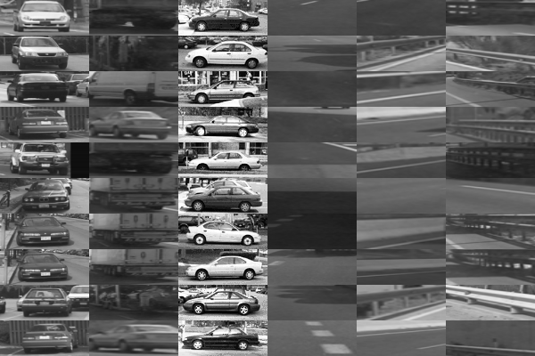
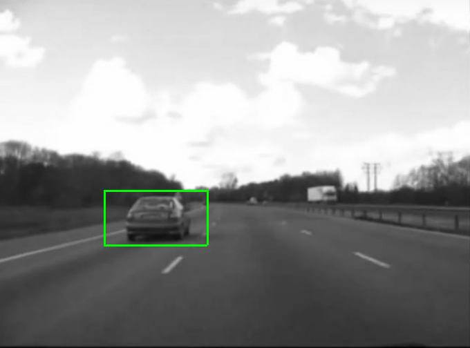

# Vehicle Detection

Overview
--------------------
Our graduation project Multi-Target Detection and Tracking in Automotive Radar Systems" was
included in Ain Shams University Interdisciplinary Graduation Project as a cooperation between Alexandria and
Ain Shams Universities; which aimed to build a prototype for Autonomous Hybrid Vehicle. Part of this project, here we have used Convolutional neural network (ConvNet) for vehicle detection. We collected several datasets, tried diferent small architectures and trained it on Jetson Tk1 (Nividia Kit).

Datasets
--------------------
Datasets used are Caltech datasets(cars 2001 rear), UIUC Image Database for Car Detection and
Vehicle Image Dataset provided by the research group (GTI).

Sample Of Training Datasets
---------------------

Feature Maps
---------------------

Result Samples
---------------------

